# AI Based Emotional Interaction Application


## Team Contribution

> | Name         | Student ID | Key Contributions                                            | Percentage |
> | ------------ | ---------- | ------------------------------------------------------------ | ---------- |
> | Yi Guan      | 2352852    | • Heart Memo Feature<br>• Main Interface Design<br>• Database Schema<br>• AI Sprite Design<br/>• Data Persistence Layer<br/>• Data Display Interface | 33.3%      |
> | Ran Li       | 2352616    | • LLM API Architecture<br>• Speech Recognition Interface<br>• Conversational AI Engine<br>• Chat UI Framework<br/>• Error Resilience System | 33.3%      |
> | Guangchun Yu | 2352740    | • Gesture Recognition API<br>• Mini-Game Design<br>• Multi-Mode Game Launcher<br>• Game UI Design | 33.3%      |
>
> **Contribution Metrics:**
>
> 1. Git commit statistics
> 2. Module complexity
> 3. Documentation/test coverage
> 4. Active working hours


## 1.Introduction

This project is a multimodal emotional interaction AI application that integrates three interaction modes: voice, text, and gesture. Built with C# and WPF, the application incorporates Baidu Speech Recognition API (ASR), the OpenAI GPT-4o large language model, and the MediaPipe-based Hand Landmark Sparse gesture recognition model, enabling natural and smooth human-machine emotional communication and companionship.

### 1.1 How to Run

**Prerequisites:**

- Windows 10/11 operating system
- .NET 8.0 Runtime or SDK installed
- Visual Studio 2022 (recommended) or Visual Studio Code with C# extension
- Camera access for gesture recognition features
- Microphone access for voice input features

**Setup Steps:**

1. **Clone the Repository:**

```bash
git clone https://github.com/ggyy1122/AI-based-emotional-companion-app.git
cd AI-based-emotional-companion-app
```

2. **Configure API Keys:**

- Open `Services/Voice/VoiceServiceSetting.cs`
- Replace placeholder values with your Baidu Speech API credentials
- Open `Services/AIChat/AIConfigSetting.cs`
- Replace placeholder values with your API key for GPT-4o access

3. **Install Dependencies:**

```bash
dotnet restore
```

1. **Build the Application:**

```bash
dotnet build
```

2. **Run the Application:**

```bash
dotnet run
```

**Alternative Method (Visual Studio):**

1. Open `GameApp.csproj` in Visual Studio 2022
2. Ensure all NuGet packages are restored automatically
3. Configure API keys as mentioned above
4. Press F5 or click "Start" to run the application

**First Launch:**

- The application will automatically create a local SQLite database (`game.db`)
- Grant camera and microphone permissions when prompted
- The gesture recognition model will be loaded automatically from the `Models/` directory

**Troubleshooting:**

- Ensure your camera is not being used by other applications
- Verify API keys are correctly configured and have sufficient quota
- Check that all required NuGet packages are properly installed

**Direct Execution (Release Build) **

For quick testing without compilation:

1. Navigate to the release folder:

   ```bash
   cd Release\net8.0-windows
   ```

2. Double-click `GameApp.exe` or run via command line:

   ```bash
   .\GameApp.exe
   ```

**Note:**  

- Ensure all files in the folder remain together (especially `.dll` and `Models/`)
- API configurations still apply 

### 1.2 Key Technologies Overview

| Technology Name                  | Purpose / Description                                                             |
| -------------------------------- | --------------------------------------------------------------------------------- |
| **C# & .NET**                    | Main development language and framework, ensuring efficiency and compatibility    |
| **WPF**                          | Modern desktop UI construction, supporting animation and page navigation          |
| **Baidu Speech Recognition API** | Converts speech input to text, enhancing natural interaction                      |
| **GPT-4o (OpenAI)**              | Intelligent conversation and sentiment analysis                                   |
| **hand_landmark_sparse Model**   | Real-time gesture recognition, supporting multimodal interaction and game control |
| **SQLite**                       | Local database for persistent storage of user data and analysis results           |
| **OpenCV/NAudio etc.**           | Image processing, gesture recognition, and audio processing                       |

### 1.3 Program Structure & Main Modules

The project adopts a layered and modular design with a clear structure for easy maintenance and expansion.

```
GameApp/
├── Controls/         # Custom controls, including the sprite control
├── Models/           # Data models, AI, and gesture models
├── Pages/            # Feature pages (main page, chat, memo, mini-games, data, etc.)
├── Resources/        # Static resource files
├── Services/         # Business services
│   ├── AIChat/           # AI chat services
│   ├── Handgesture/      # Gesture recognition services
│   ├── HeartMemo/        # Memo services
│   ├── Interfaces/       # Interface definitions
│   ├── Voice/            # Speech recognition and synthesis services
│   └── HandGestureManager.cs
├── Voices/           # User audio data
├── Window/           # Window implementations
├── App.xaml(.cs)     # Application entry and global configuration
├── AssemblyInfo.cs   # Assembly and resource configuration
├── game.db           # Local database
└── MainWindow.xaml   # Main interface
```

### 1.4 Main Functional Modules

1. **Main Interface & Sprite Interaction**  

- The sprite acts as a virtual companion, supporting interaction with the user and creating a friendly atmosphere.

2. **Chat Page**  

- Supports text/voice input and conversation collection, with GPT-4o enabling natural, emotional dialogues.

3. **Memo Page**  

- Supports daily notes, mood categorization, and persistent management, helping users organize emotions and memories.

4. **Mini-game Page**  

- Integrated stress-relief mini-games (such as turret games), supporting both standard and gesture modes for a richer experience.

5. **Data Page**  

- Visualizes emotional trends, chat statistics, and behavior analysis, helping users better understand and grow themselves.

### 1.5 Module Relationships & Interaction Flow

- Users can interact with the sprite on the main interface and freely switch between chat, memo, mini-games, and data pages.
- Data from chats, games, and emotion analysis are synchronized to the data page for convenient review and analysis.
- All AI services (speech recognition, gesture recognition, intelligent conversation) can be flexibly used across feature pages, enhancing the overall interactive experience.

## 2. Application Requirements

### 2.1 Target Users & Design Background

With the increasing popularity of AI assistants, more and more students and people living alone frequently use AI tools in their daily life and study. While these users benefit from the convenience of information, they also have stronger needs for emotional communication and psychological support. Therefore, this application is specifically designed for ordinary users who need emotional companionship and psychological care (especially students and people living alone), aiming to provide warm and intelligent emotional support through AI.

### 2.2 User Needs & Implemented Features

Major user needs include:

- The ability to have natural, continuous, and emotionally rich conversations with AI for companionship and care
- Recording and managing daily moods and events for self-reflection and emotional organization
- Fun stress-relief mini-games to help release pressure and regulate emotions
- Visual analysis of emotional and behavioral data to promote self-understanding and growth
- Support for multimodal interaction (voice, text, gesture) to suit different user habits

Based on these needs, the application implements the following core features with specific descriptions:

- **AI Emotional Chat (supports text and voice input)**

Integrates the GPT-4o multimodal large model. Users can have natural, smooth, and emotionally rich conversations with AI via text or voice. The AI can understand context and emotions, providing intelligent and warm responses for true companionship and interaction.

- **AI Sprite Interaction**

A virtual sprite image is set within the application, interacting with users in a humanized way to provide a more vivid and interesting emotional companionship experience, enhancing users’ sense of belonging.

- **Speech and Gesture Recognition**

Integrates Baidu Speech Recognition API and Hand Landmark Sparse gesture model to support multimodal input. Users can communicate with AI via speech and control mini-games via camera gestures, greatly enhancing the diversity and fun of interaction.

- **Memo and Mood Journal Management**

Provides memo and mood journal functions, allowing users to record daily trivia, mood changes, and important events anytime, with support for categorization, search, and persistent storage to better manage emotions and life.

- **Stress-relief Mini-games (standard & gesture modes included)**

Built-in stress-relief mini-games (such as turret games), where users can choose traditional or gesture control modes, offering both entertainment and physical interaction for stress release and mood regulation.

- **Data Statistics and Visual Feedback**

Automatically analyzes users’ emotional changes, chat history, and behavioral data, presenting them visually with charts, helping users self-analyze and grow, and improving self-emotional management abilities.

### 2.3 User Interaction & User-friendly Design

- The main interface adopts a virtual sprite image to enhance affinity and lower the interaction threshold
- Supports multiple input methods to suit different user habits, improving usability
- Simple and clear page layout with intuitive navigation for easy use
- The data page uses charts and similar forms to visually display users' emotional changes, making self-adjustment easier
- Both game and chat functions incorporate an atmosphere of emotional care, enhancing user belonging
- Supports persistent storage of user data

## 3. Features Implemented

> **Detailed Implementation Guide Available**  
> For comprehensive code implementation details, technical specifications, and development documentation, please visit: [https://deepwiki.com/ggyy1122/AI-based-emotional-companion-app](https://deepwiki.com/ggyy1122/AI-based-emotional-companion-app)


### 3.1 AI Emotional Chat System

**Core Functionality:**

- **Intelligent Conversation Engine**: Integrates OpenAI GPT-4o model through OpenRouter API, providing contextually aware and emotionally intelligent responses
- **Multimodal Input Support**: Users can interact via text input or voice commands using Baidu Speech Recognition API
- **Streaming Response Display**: Real-time display of AI responses with markdown support for rich text formatting
- **Session Management**: Persistent chat history with ability to create, switch, and manage multiple conversation sessions
- **Favorite Conversations**: Users can bookmark important conversations for easy access and review

**User Needs Satisfied:**

- Provides 24/7 emotional companionship for users feeling lonely or needing someone to talk to
- Offers intelligent conversation that understands context and emotions, making interactions feel natural
- Supports different communication preferences (text vs. voice) for accessibility
- Maintains conversation history for users who want to revisit meaningful exchanges

### 3.2 Heart Memo & Emotion Journal

**Core Functionality:**

- **Mood-based Journaling**: Users can create daily memos with customizable emotion colors representing their feelings
- **Voice Recording Integration**: Each memo supports voice note attachments using NAudio for audio recording and playback
- **Persistent Storage**: SQLite database ensures all memos and voice recordings are saved locally and securely
- **Visual Organization**: Color-coded emotion system helps users categorize and track their emotional states
- **Search and Filter**: Easy navigation through past entries with date-based sorting

**User Needs Satisfied:**

- Helps users process and organize their emotions through written and vocal expression
- Provides a private space for self-reflection and emotional growth
- Supports different expression methods (text, voice) for users who prefer speaking over writing
- Creates a personal emotional timeline for tracking mood patterns over time

### 3.3 Interactive AI Sprite Companion

**Core Functionality:**

- **Dynamic Mood Expression**: Virtual sprite responds to user interactions and displays different emotional states
- **Context-Aware Behavior**: Sprite's mood changes based on user selections and overall application state
- **Interactive Dialogue System**: Direct communication with sprite through popup dialogs
- **Visual Feedback**: Animated responses and bubble messages provide engaging user interaction

**User Needs Satisfied:**

- Creates a sense of companionship through anthropomorphic design
- Provides immediate emotional feedback and validation
- Makes the application feel more personal and less clinical
- Appeals to users who benefit from visual and character-based interaction

### 3.4 Gesture Recognition Integration

**Core Functionality:**

- **Hand Landmark Detection**: Implements MediaPipe-based hand gesture recognition using ONNX model
- **Real-time Processing**: Live camera feed analysis for gesture detection and classification
- **Game Control Integration**: Gesture commands can control mini-games and application navigation
- **Accessibility Support**: Provides alternative input method for users with different physical capabilities

**User Needs Satisfied:**

- Offers innovative interaction methods beyond traditional input devices
- Provides engaging entertainment through gesture-controlled games
- Supports accessibility needs for users who may have difficulty with standard inputs
- Adds a physical activity component to reduce sedentary behavior

### 3.5 Comprehensive Data Analytics Dashboard

**Core Functionality:**

- **Multi-source Data Integration**: Aggregates data from chat sessions, memos, games, and user interactions
- **Visual Statistics Display**: Charts and graphs showing conversation frequency, emotional trends, and activity patterns
- **Progress Tracking**: Monitors user engagement levels and application usage patterns
- **Emotional Timeline**: Visual representation of mood changes over time based on memo data

**User Needs Satisfied:**

- Helps users understand their emotional patterns and behavioral trends
- Provides motivation through progress tracking and achievement visualization
- Supports self-awareness and personal growth through data-driven insights
- Enables users to make informed decisions about their emotional well-being

### 3.6 Voice Integration System

**Core Functionality:**

- **Speech-to-Text Conversion**: Baidu ASR API integration for accurate voice input processing
- **Text-to-Speech Synthesis**: AI responses can be read aloud automatically or on-demand
- **Voice Message Recording**: High-quality audio recording and playback for memos
- **Multilingual Support**: Handles various accents and speaking patterns through cloud-based processing

**User Needs Satisfied:**

- Accommodates users who prefer verbal communication over typing
- Supports accessibility needs for visually impaired or mobility-restricted users
- Provides hands-free interaction options for multitasking scenarios
- Creates more natural and conversational user experience

## 4. Advantages, Innovations and Limitations

### 4.1 Technical Architecture Innovations

**Multimodal Integration Excellence:**

- **Seamless Cross-Modal Communication**: Unlike traditional single-mode applications, this system uniquely integrates text, voice, and gesture inputs within a unified conversational context, allowing users to switch between input methods mid-conversation without losing context
- **Real-time Streaming Response System**: Implements advanced streaming text display with markdown rendering, providing immediate visual feedback during AI response generation rather than waiting for complete responses
- **Modular Service Architecture**: Employs a sophisticated separation of concerns with dedicated service layers ([`Services/AIChat`](Services/AIChat), [`Services/Voice`](Services/Voice), [`Services/Handgesture`](Services/Handgesture)) enabling independent scaling and maintenance

**Advanced Data Management:**

- **Intelligent Session Management**: Features sophisticated chat session handling with automatic context preservation, favorite marking, and cross-session data correlation through [`ChatDbService`](Services/AIChat/ChatDatabaseService.cs.cs)
- **Multimodal Data Synchronization**: Seamlessly correlates voice recordings, text entries, and gesture interactions within unified memo objects using [`MemoVoiceDbService`](Services/HeartMemo/MemoVoiceDbService.cs)

### 4.2 User Experience Innovations

**Anthropomorphic Interaction Design:**

- **Context-Aware Virtual Companion**: The [`SpriteControl`](Controls/SpriteControl.xaml) responds dynamically to user emotional states and interactions, creating a more engaging and less clinical experience compared to traditional chatbots
- **Emotional State Visualization**: Implements color-coded emotion tracking that provides immediate visual feedback and helps users recognize emotional patterns over time

**Accessibility-First Approach:**

- **Universal Input Support**: Accommodates users with different physical capabilities through voice input via [`VoiceInputDialog`](Pages/VoiceInputDialog.xaml.cs), gesture recognition via [`HandLandmarkDetector`](Services/Handgesture/HandLandmarkDetector.cs), and traditional text input
- **Persistent Context Awareness**: Maintains conversation context across different input modalities, allowing users to start typing and finish speaking without losing conversational flow

### 4.3 Privacy and Security Advantages

**Local-First Data Architecture:**

- **On-Device Data Storage**: Utilizes SQLite for local data persistence, ensuring user privacy and reducing dependency on cloud storage for sensitive emotional data
- **Selective Cloud Integration**: Only sends necessary conversation data to AI services while keeping personal memos, voice recordings, and emotional tracking data locally stored

**User Data Sovereignty:**

- **Complete Data Control**: Users maintain full ownership of their emotional journals, voice recordings, and interaction history without mandatory cloud synchronization
- **Transparent Data Usage**: Clear separation between local processing (gesture recognition, voice recording) and cloud services (AI conversation) with user awareness

### 4.4 Performance and Scalability Innovations

**Efficient Resource Management:**

- **ONNX Model Integration**: Employs optimized [`hand_landmark_sparse_Nx3x224x224.onnx`](Models/hand_landmark_sparse_Nx3x224x224.onnx) model for real-time gesture recognition without requiring GPU acceleration
- **Asynchronous Processing Pipeline**: Implements non-blocking UI updates through streaming responses and background data processing, maintaining responsiveness during intensive operations

**Adaptive User Interface:**

- **Dynamic Layout Management**: Features collapsible sidebars and responsive design elements that adapt to user preferences and screen sizes
- **Progressive Data Loading**: Implements lazy loading for chat history and memo collections, improving startup performance and memory usage

### 4.5 Therapeutic and Wellness Innovations

**Evidence-Based Emotional Support:**

- **Comprehensive Mood Tracking**: Combines multiple data sources (text analysis, voice patterns, interaction frequency) to provide holistic emotional state assessment
- **Non-Intrusive Monitoring**: Passively collects emotional indicators through natural interactions rather than requiring explicit mood reporting

**Gamified Wellness Approach:**

- **Therapeutic Gaming Integration**: Incorporates stress-relief games controllable through gesture recognition, combining physical activity with emotional regulation
- **Achievement-Based Motivation**: Provides visual progress tracking through the [`SpiritDashboard`](Pages/SpiritDashboard.xaml.cs) to encourage consistent emotional self-care practices

### 4.6 Competitive Advantages

**Market Differentiation:**

- **Holistic Companion Experience**: Unlike single-purpose mental health apps or basic chatbots, provides a comprehensive emotional support ecosystem combining conversation, journaling, gaming, and analytics
- **Technology Integration Depth**: Seamlessly blends cutting-edge AI (GPT-4o), computer vision (MediaPipe), and speech recognition (Baidu ASR) into a cohesive user experience

**Cost-Effective Implementation:**

- **Open Source Foundation**: Leverages open standards (ONNX, SQLite) and APIs rather than proprietary solutions, reducing licensing costs and vendor lock-in
- **Scalable Architecture**: Modular design allows for feature expansion and technology upgrades without complete system rebuilds

### 4.7 Limitations

- **Homepage Integration**: The embedding of functional modules feels unnatural, and the connections between features lack cohesiveness.
- **AI Chat Limitations**: The AI chat currently does not support file attachments.
- **Mini-Game Loading Delay**: Upon entering the mini-game, users experience a noticeable wait time due to model loading and camera initialization.
- **Gesture Recognition Constraints**: The gesture control system requires specific hand-to-camera distances and precise hand shapes, which may challenge first-time users during adaptation.
- **Audio Feedback Missing**: The application lacks sound effects, diminishing interactive feedback.

## 5. Future Optimization

### 5.1 Enhanced AI Capabilities

**Emotional Intelligence Improvements:**

- Implement advanced emotion detection from text and voice tone analysis
- Add personality customization options for the AI companion
- Develop context-aware response generation based on user's emotional history
- Integrate computer vision for facial expression recognition during video calls

**Conversation Quality Enhancement:**

- Add support for multiple AI models with different personalities and specializations
- Implement conversation summary and key insight extraction features
- Develop proactive conversation starters based on user patterns and preferences
- Add multilingual conversation support for international users

### 5.2 Advanced Analytics and Insights

**Predictive Analytics:**

- Implement mood prediction algorithms based on historical data patterns
- Add early warning systems for potential emotional distress periods
- Develop personalized recommendation systems for activities and coping strategies
- Create comparative analysis with anonymized user data for benchmarking

**Enhanced Visualization:**

- Add interactive charts with drill-down capabilities for detailed analysis
- Implement custom dashboard creation for personalized data views
- Develop export functionality for sharing data with healthcare providers
- Add goal-setting and progress tracking features with visual milestones

### 5.3 Expanded Interaction Modalities

**Gesture Recognition Enhancement:**

- Expand gesture vocabulary for more complex commands and interactions
- Add full-body pose detection for physical exercise and wellness tracking
- Implement custom gesture training for personalized command creation
- Develop gesture-based art creation and expression tools

**Augmented Reality Integration:**

- Add AR companion mode for mobile devices
- Implement spatial gesture recognition in 3D environments
- Develop location-based emotional support and memory associations
- Create AR-based mindfulness and meditation experiences

### 5.4 Social and Community Features

**Peer Support Network:**

- Implement anonymous peer support groups with moderated discussions
- Add community challenges and group activities for emotional wellness
- Develop mentorship matching system for users seeking guidance
- Create shared experience features while maintaining privacy

**Professional Integration:**

- Add therapist/counselor integration options for professional support
- Implement crisis intervention protocols with emergency contact features
- Develop progress reports suitable for mental health professionals
- Add appointment scheduling and reminder systems

### 5.5 Platform and Performance Enhancements

**Cross-Platform Expansion:**

- Develop mobile applications (iOS/Android) with cloud synchronization
- Create web-based interface for universal accessibility
- Implement smart watch integration for quick emotional check-ins
- Add voice assistant integration (Alexa, Google Assistant) support

**Technical Improvements:**

- Optimize AI response times and reduce latency
- Implement offline mode capabilities for core features
- Add end-to-end encryption for enhanced privacy protection
- Develop plugin architecture for third-party integrations

**Accessibility and Inclusivity:**

- Add comprehensive screen reader support and high contrast themes
- Implement voice-only navigation mode for visually impaired users
- Add cognitive accessibility features for users with learning differences
- Develop content adaptation based on individual accessibility needs

## 6. Interface Effects

### 6.1 Main Page

- Users can interact with the sprite. For example, by clicking or dragging a specific location, the sprite will move to the corresponding position. The sprite periodically displays relaxing messages, and the message style can be changed by altering the sprite's state.
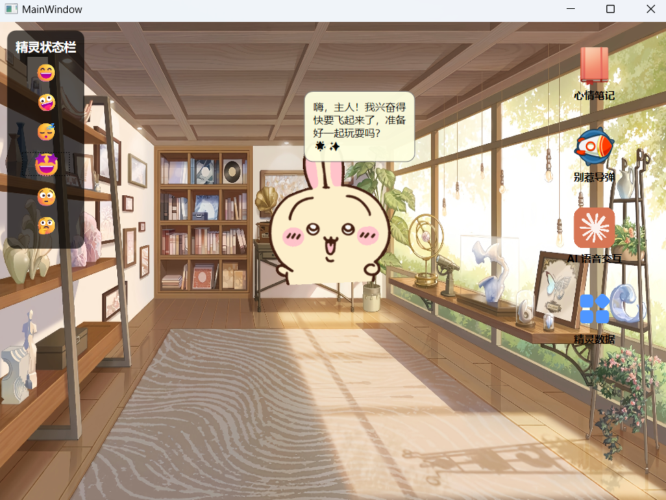
- Double-click the sprite to open a simple AI companion chat window.
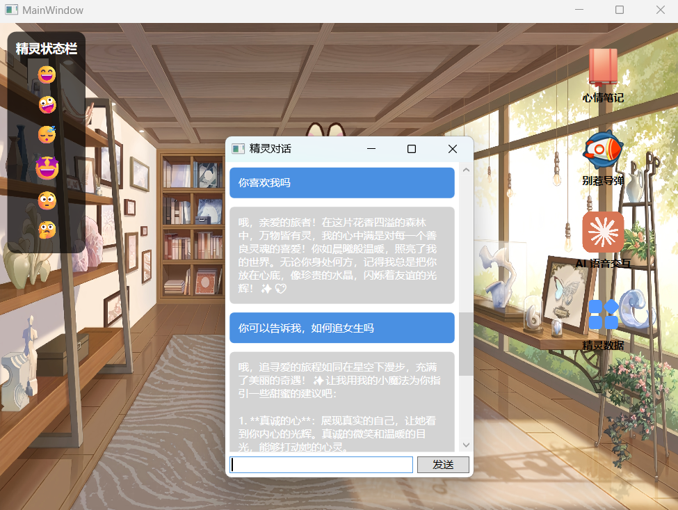

### 6.2 AI Chat

- Multiple chat sessions can be created.Important chats can be bookmarked.
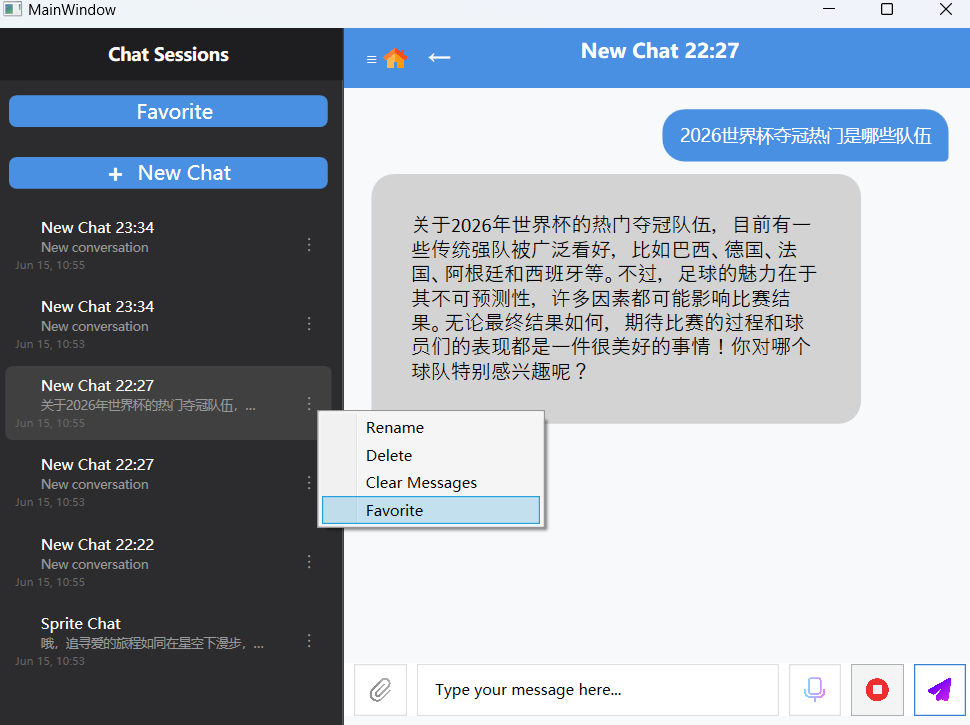
- Click "favorite" to view the bookmarked chats.
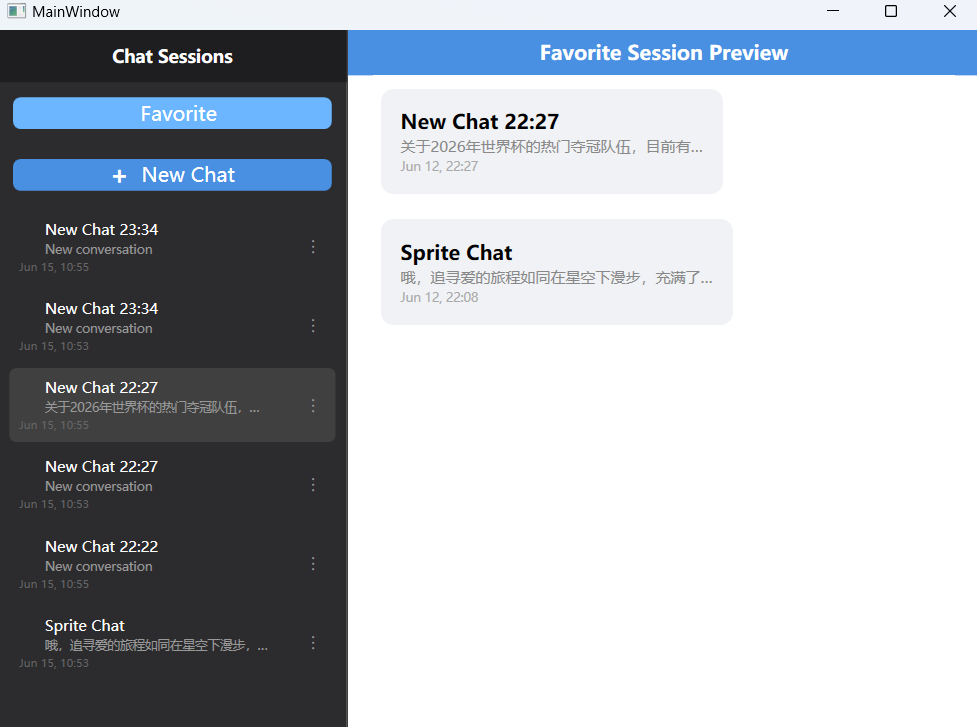
- Click the voice button in the lower-right corner to enter the voice chat interface.
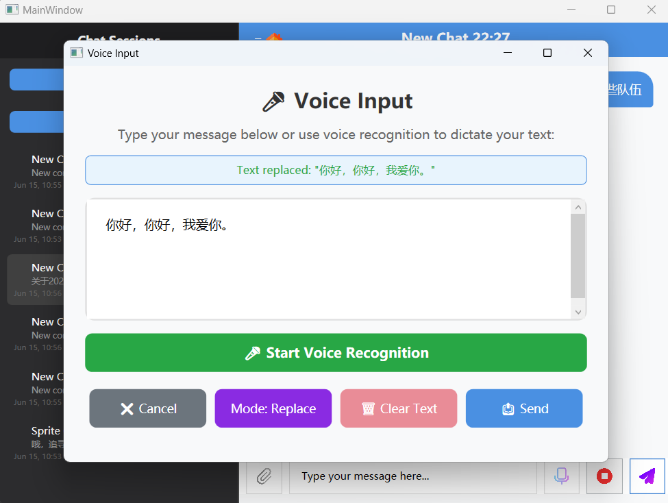

### 6.3 Memorandum of Thoughts

- Multiple memos can be created, and content can be entered into them.
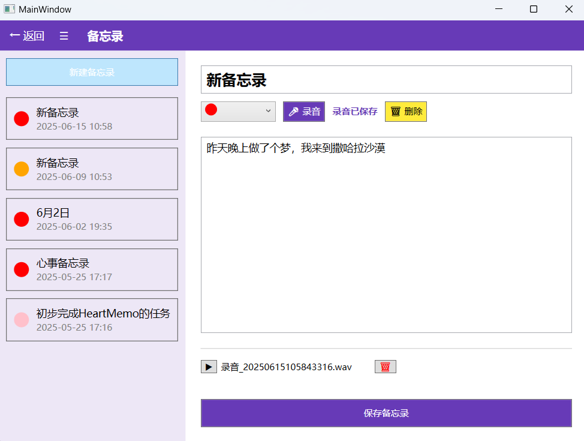
- Voice recording is supported.
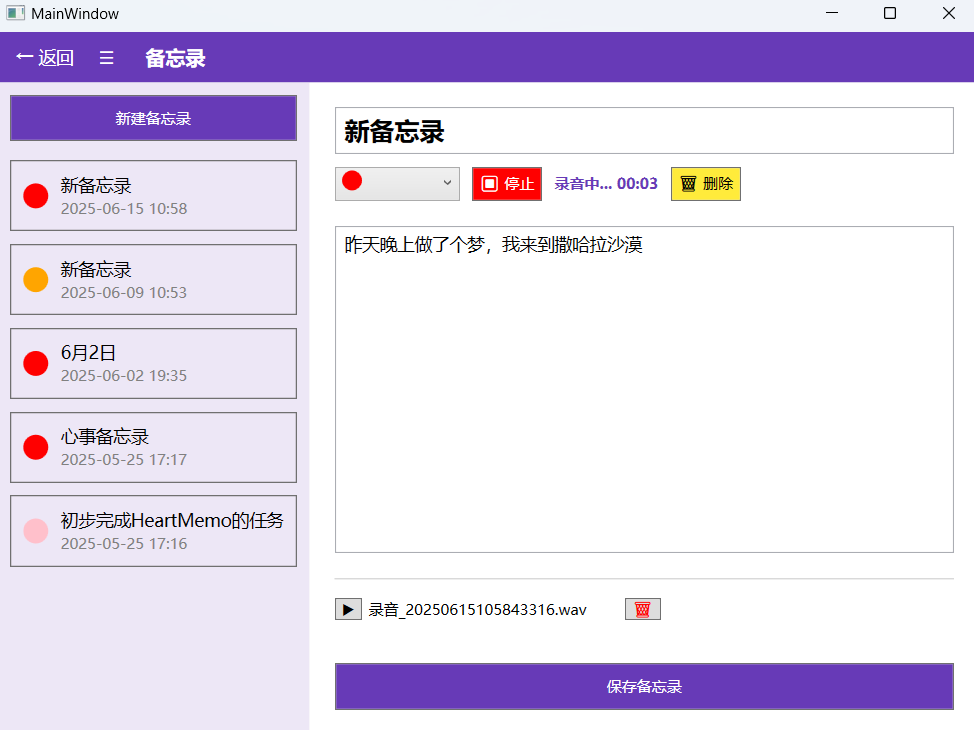
- Saved entries can be viewed.
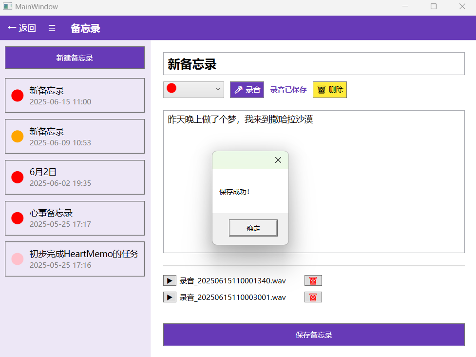

### 6.4 Stress-Relief Mini-Game

- The mini-game interface defaults to mouse controls. The turret rotates toward the mouse position to fire and eliminate monsters.
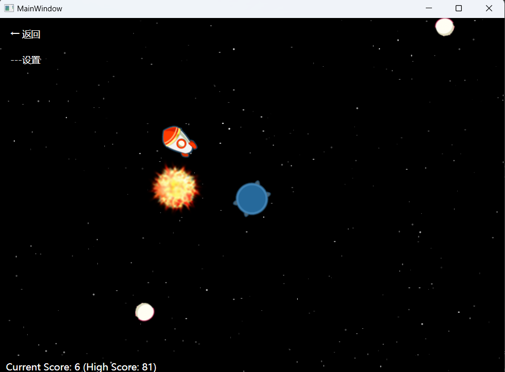
- Click "Settings" to choose the control mode (mouse or gesture) or adjust the monster spawn speed.
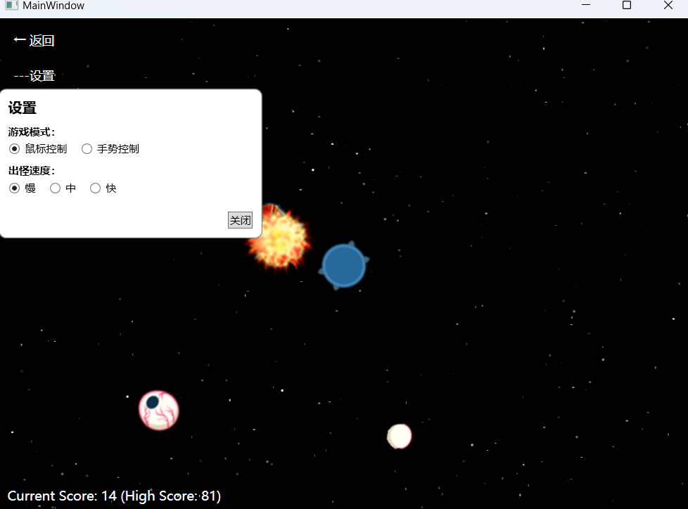
- Gesture recognition controls the game—the turret fires in the direction pointed by the thumb.
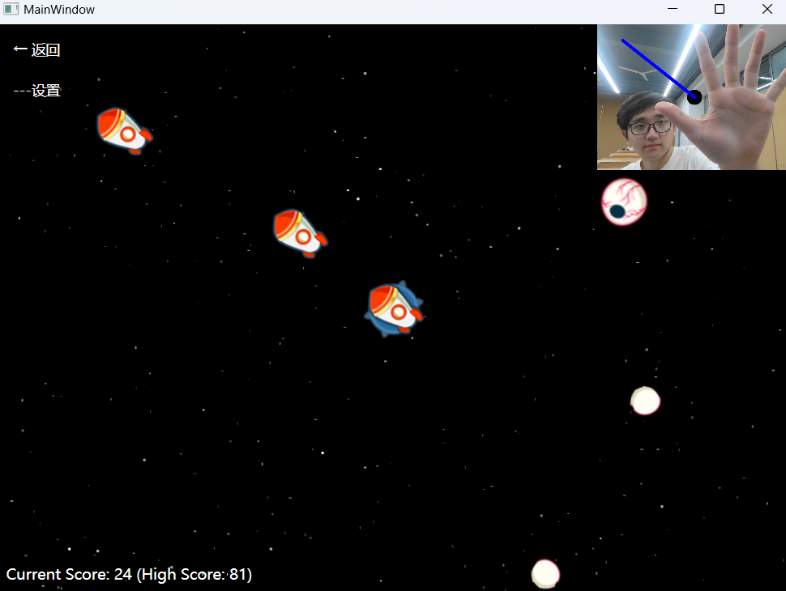

### 6.5 Sprite data interface

- Sprite data interface for viewing various records.
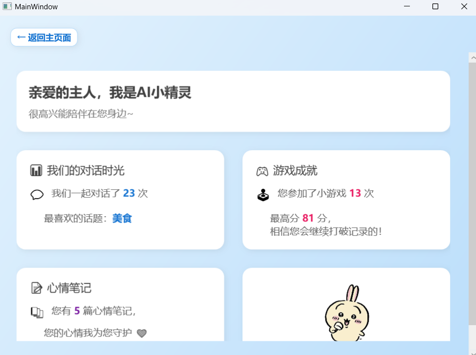
